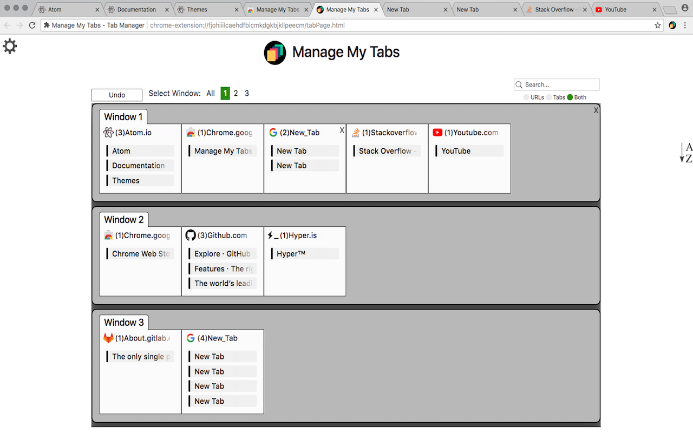

<h1 align="middle">
</img>
 Manage My Tabs -  Window and Tab Manager  
</img>
</h1>

## Description

Manage My Tabs is an extension that gives the user a quick and simple way to manage their tabs. Tabs are grouped by website name and are shown in one convinient tab that the user may search and customize. From the manager tab, the user can navigate to any tab, close tabs individually or by groups and view tabs from other windows.

## Website
https://adamjamesadair.github.io/manage-my-tabs

## Installation
### Chrome
Install the latest release through the chrome web store: \
https://chrome.google.com/webstore/detail/manage-my-tabs-tab-manage/jbhejjmjopbmikcoffcckcnbaiohgbge 

#### Unpacked Extension (Development release)
- If you downloaded the code, unzip the file.
- Open the extension manager by navigating to [chrome://extensions/](chrome://extensions/) or by clicking `Window -> Extensions`.
- Enable developer mode with the toggle in the top right corner.
- Click `LOAD UNPACKED` and select the source code folder or drag the folder into the window.

### Firefox
Install the latest release through the firefox add-on gallery: \
https://addons.mozilla.org/en-US/firefox/addon/manage-my-tabs/
#### Unpacked Extension (Development release)
- If you downloaded the code, unzip the file.
- Open the extension manager by navigating to [about:debugging](about:debugging).
- Click `Load Temporary Add-on` and select the manifest.json file.

For development releases, download the [source code](https://github.com/adamjamesadair/manage-my-tabs) or clone this repository.

## Contributing

Thank you for your interest in the development of Manage My Tabs!

Please look at the [project boards](https://github.com/adamjamesadair/manage-my-tabs/projects) and specifically the [Main Development](https://github.com/adamjamesadair/manage-my-tabs/projects/4) project to see our plans for future releases.

Please work from and submit all pull requests to the `develop` branch. The `master` branch is reserved for public releases and will often be several commits behind the `develop` branch.

### Pull Requests
Please submit an issue describing the nature your changes before submitting a pull request. This helps us keep track of the development process. 

## Change Log
See the change log [here](https://github.com/adamjamesadair/manage-my-tabs/blob/master/CHANGELOG.md).

## License
[MIT](http://opensource.org/licenses/MIT)
